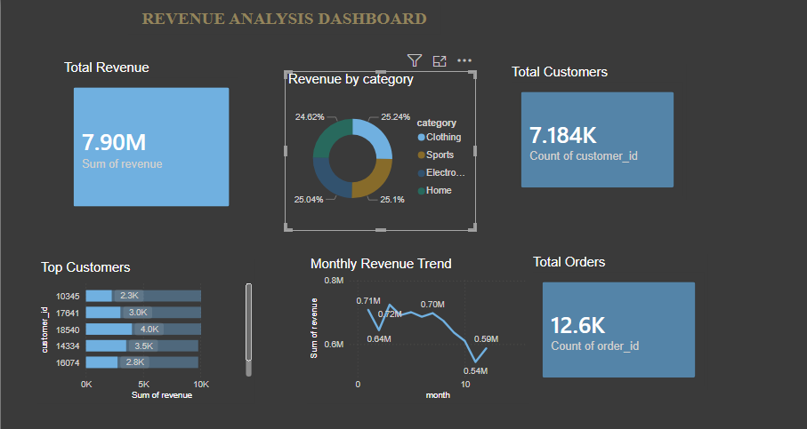
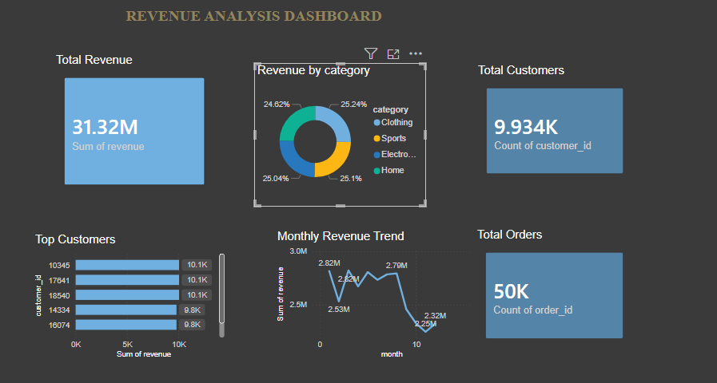

# 🛍️ Retail Data Analytics

## 📌 Overview
This project analyzes retail sales data using Python, SQL, and Power BI.

## 🛠️ Tech Stack
- Python
- SQL
- Power BI

## 📁 Project Structure
- data/
- scripts/
- sql/
- dashboards/

## 📊 Dashboard Preview

## 🚀 Key Insights
- Sales trends analysis
- Customer behavior insights
- Product performance tracking
